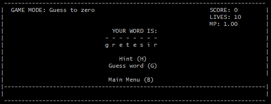

# WordJumble
C++ Course assignment 2\
_This is an implementation of version C in the assignment._

## How to play
**Windows**
1. Open the root directory (contains the run.exe file) in terminal.
2. Type `run` in terminal

**Mac/Linux**
1. Open root directory in terminal
2. Compile by typing the following command
```
$ g++ -o run.sh main.cp
$ chmod +x run.sh
```
3. Type `./run.sh` in terminal

## Demonstration
**Start menu**\
 \
**In game**\
 \
**Game over**\
 \
**Word list selection**\
 \
**Switch game mode** \


## How to add wordlist to the game
1. Create a new text file with a descriptive name in the root directory with the file ending `.txt`
2. Add words to the text file. (If you don't add anything the program will terminate with a warning message when you select it)
3. Add the name of the file **without the file ending `.txt`** into the text file called `word_lists.txt` also located in the root directory.\
_A word should  be a maximum of 255 characters. Otherwise the program will terminate with a warning message._
